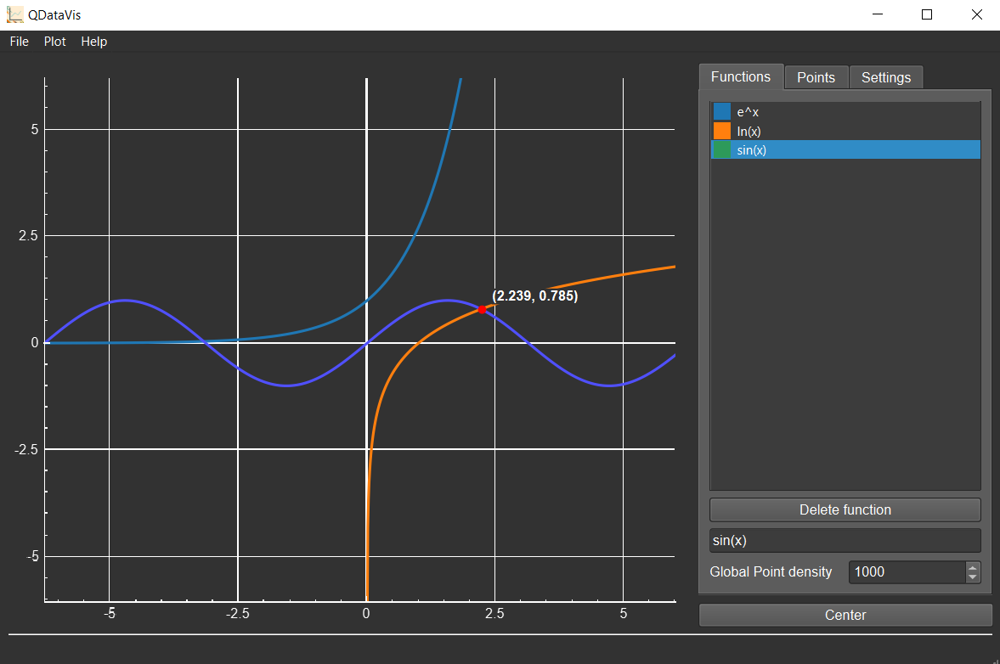

[](https://github.com/jondef/QDataVis)

[Download](https://github.com/jondef/QDataVis#-download) |
[Feedback](https://github.com/jondef/QDataVis#%EF%B8%8F-feedback)


QDataVis is a simple to use, UI based, interactive plotter powered by .

  - Includes a mathematical expression parser written by me :)
  - Ability to use OpenGL for rendering
  - Plot and visualise functions
  - Plot datasets
  - Dark mode

🚀 Features
-----------
  - Plot cursor
  - Stick tick labels to the zero on the axes
  - Save your plots as PNG, JPG, etc...
  - Configure plot aesthetics
  - Plot single data points

🖼️ Screenshot
----------


💾 Download
--------
Pre-built executables for Windows, macOS, and Linux are found on the [Releases](https://github.com/jondef/QDataVis/releases) page.

⚙️ Building from source
----------
To build QDataVis from source, you'll need:
* [Qt6] - v6.1.0+ installed and included in PATH
* [CMake] - v3.17+
----------

1. Clone the repository
```sh
git clone --recurse-submodules https://github.com/jondef/QDataVis.git
```
2. Load the CMake project and compile!
```sh
cmake ./QDataVis && make ./QDataVis/build
```

❤️ Feedback
--------
Found a bug? Got suggestions? [Create an issue](https://github.com/jondef/QDataVis/issues/new)!

📝 License
-------
Apache 2.0

[Qt6]: <https://www.qt.io/>
[QCustomPlot]: <https://www.qcustomplot.com/>
[CMake]: <https://cmake.org/download/>
